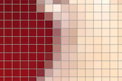

# Pixel Grid
The MATLAB function `pixelgrid` superimposes a grid of pixel edges on an image. The purpose is to easily visualize pixel extents when zooming in closely on an image. The grid is drawing using lines with contrasting colors so that it is visible regardless of the colors of the underlying pixels.

## Limitation
This function is intended for use when looking at a zoomed-in image region with a relatively small number of rows and columns. If you use this function on a typical, full-size image without zooming in, the image will be completely obscured under the grid lines.
